# Project Kingfisher

Project Kingfisher is a self-contained cybersecurity lab demonstrating 
end-to-end phishing simulation and detection engineering. Three virtual 
machines work together across an isolated NAT network to simulate the 
full attacker-defender loop, from initial email delivery through to 
SIEM-based detection rule authoring.

**DISCLAIMER:** This project is conducted entirely within an isolated lab 
environment against decoy accounts under the author's own ownership. 
All techniques demonstrated are for educational purposes only.

## Lab Environment

| VM | Role | OS | IP |
|---|---|---|---|
| Kali_Linux | Attacker | Kali Linux | 192.168.18.129 |
| Windows 10 x64 | Victim | Windows 10 | 192.168.18.128 |
| Ubuntu_Ult | Defender | Ubuntu Server 22.04.5 LTS | 192.168.18.130 |

## Phases

| Phase | Focus | Status |
|---|---|---|
| Phase 1 | Attacker Infrastructure & Phishing Campaign | Completed |
| Phase 2 | Victim Instrumentation & Telemetry Capture | Completed |
| Phase 3 | Detection Engineering & SIEM Rule Authoring | In Progress |

---

# Project Kingfisher | Phase 1: Attacker Infrastructure & Phishing Campaign

**Duration:** 19/04/2026 → 30/04/2026  

**Platform:** Kali Linux (VMware Workstation Pro), Windows 10 (VMware Workstation Pro)  

**Tools:** Gophish, Gmail SMTP, Custom HTML Landing Page

## Overview

Deployed a fully operational phishing infrastructure on an isolated lab network. Executed two real phishing campaigns against decoy victims, capturing credentials and observing live defensive mechanisms across both runs.

---

## Infrastructure

| Component | Detail |
|---|---|
| Phishing Framework | Gophish 0.12.1 on Kali Linux |
| Email Delivery | Gmail SMTP (smtp.gmail.com:587) with app password auth |
| Landing Page | Cloned Microsoft 365 login page (Harvest #1) → custom HTML form (Harvest #2) |
| Attacker IP | 192.168.18.129 |
| Victims | 2 decoy Gmail accounts |

---

## Campaign Results

### Harvest #1

| Victim | Sent | Opened | Clicked | Submitted |
|---|---|---|---|---|
| James Smith | OK | OK | OK | Blocked |
| Sarah Chen | OK | OK | OK | Blocked |

**Campaign dashboard showing 2 sent, 2 opened, 2 clicked, 0 submitted.**

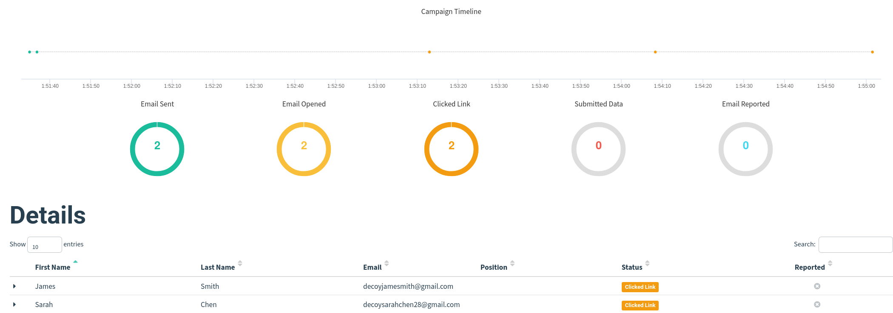

**Email Delivery to James Smith:**  
Email delivered directly to the primary inbox with personalised greeting and functioning phishing link.

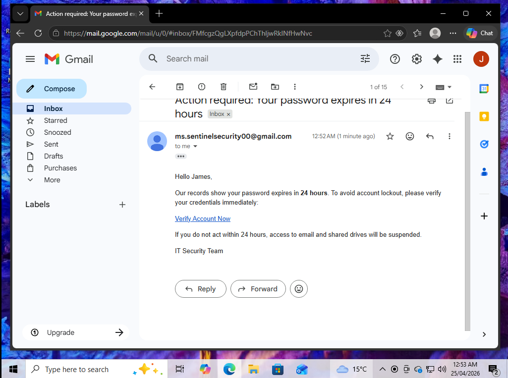

**Email Delivery to Sarah Chen:**  
Email automatically routed to Gmail's spam folder with reputation-based filtering banner. Subsequently retrieved manually from spam by the victim.

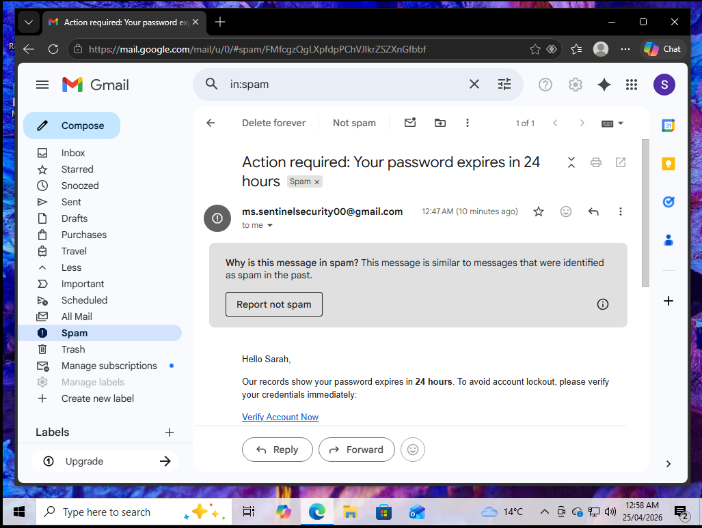

**Defensive Block to Client-Side Validation:**  
Both victims clicked the phishing link, loading the cloned Microsoft 365 login page served from the attacker's infrastructure (192.168.18.129). However, credential submission was blocked by Microsoft's retained client-side JavaScript validation, which attempted to authenticate Gmail addresses against Microsoft's directory service.

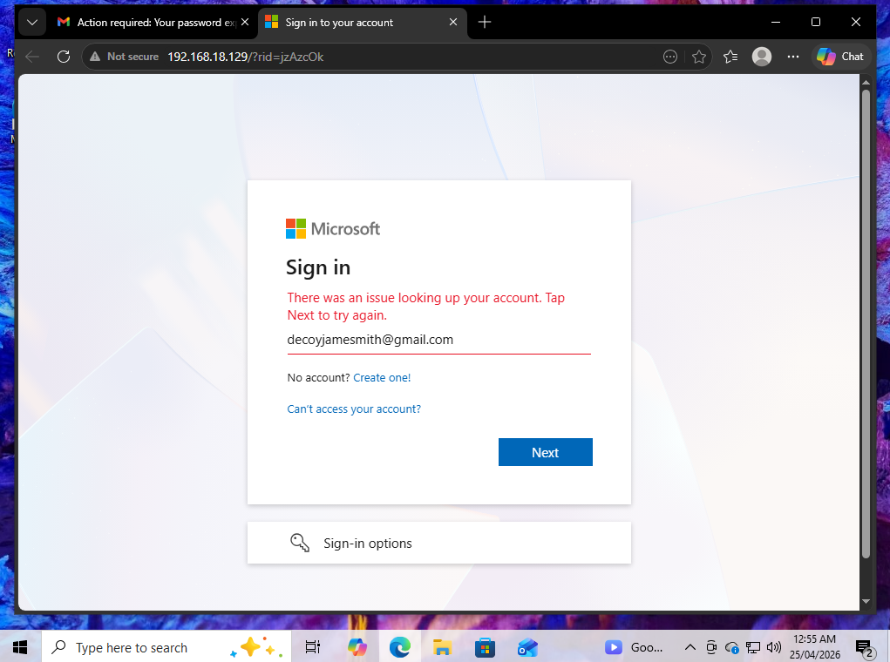

---

### Harvest #2

| Victim | Sent | Opened | Clicked | Submitted |
|---|---|---|---|---|
| James Smith | OK | OK | OK | OK |
| Sarah Chen | OK | OK | OK | OK |

**Campaign dashboard showing 2 sent, 2 opened, 2 clicked, 2 submitted.**

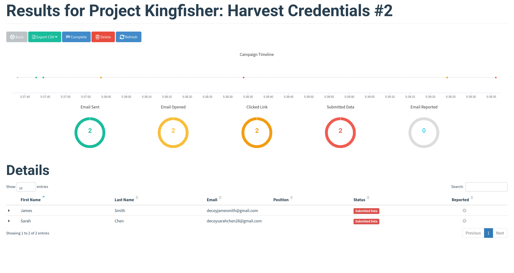

**Custom HTML Landing Page:**  

Cloned Microsoft 365 page replaced with externally-sourced custom HTML form, bypassing the client-side validation block from Harvest #1.

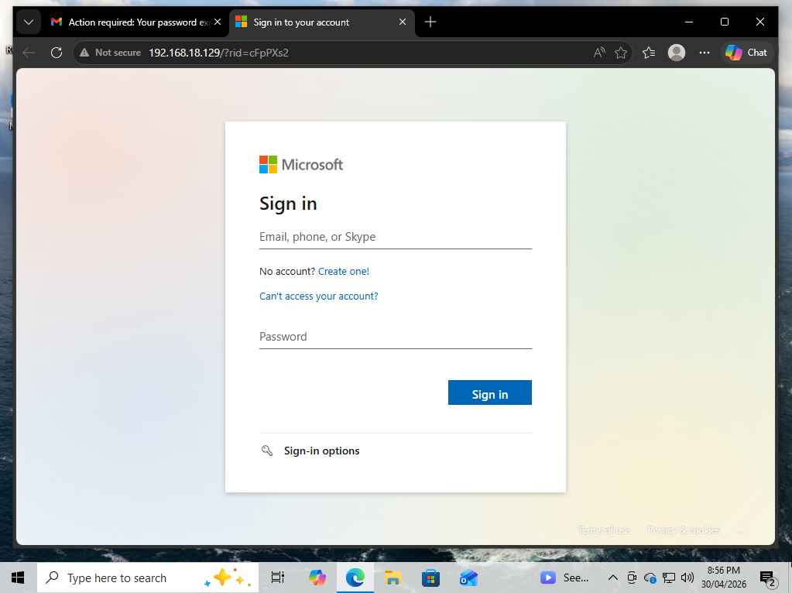

**Custom HTML Redirect:**  

Upon credential submission, victims were redirected to a custom HTML page hosted on the attacker's infrastructure (192.168.18.129:8080), confirming the simulated attack was successful.

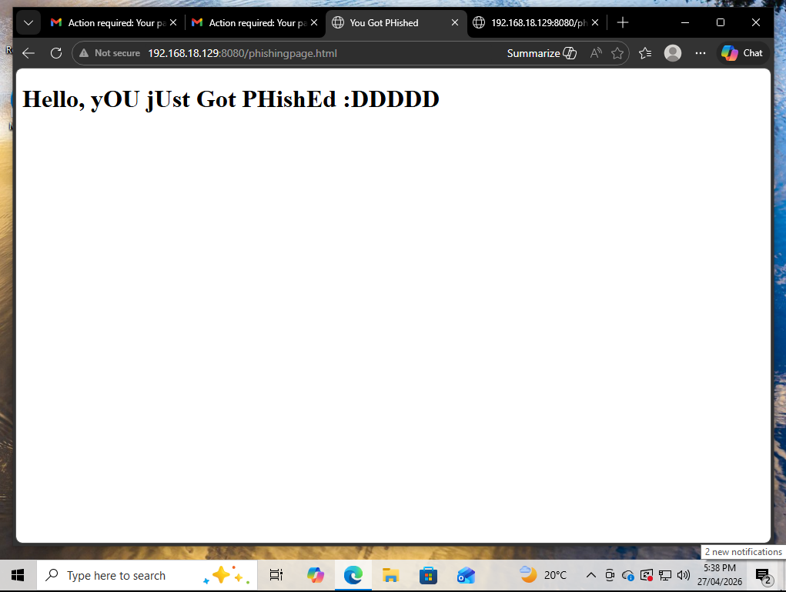

**Victim Timeline of James Smith:** 

Full attack chain captured with OS and browser fingerprinting on each event (Windows 10, Chrome 147.0.0.0).

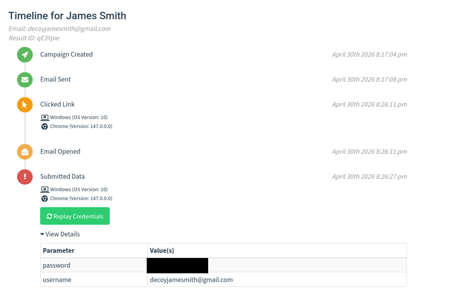

**Victim Timeline of Sarah Chen:**  

Full attack chain captured with OS and browser fingerprinting on each event (Windows 10, Chrome 147.0.0.0).

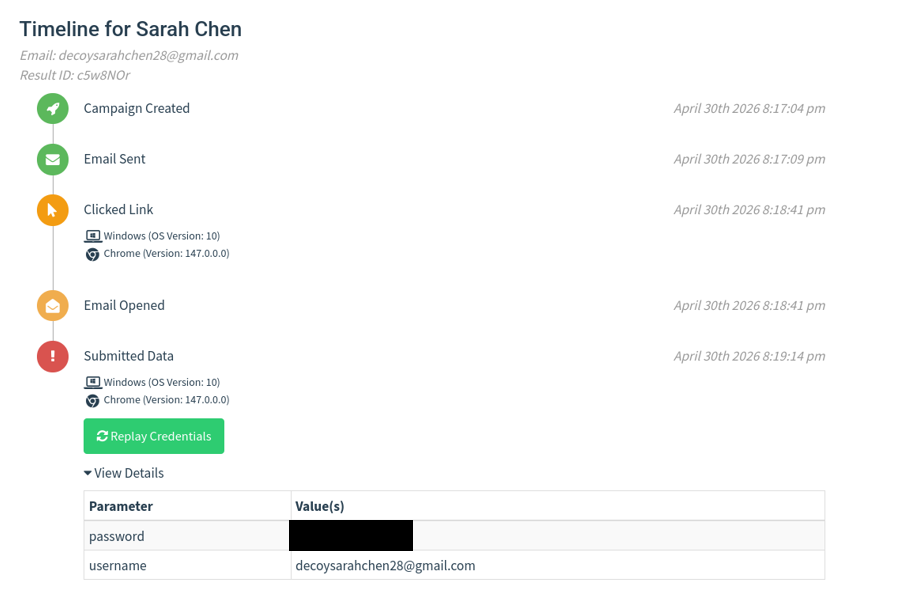

---

## Key Observations

**Harvest #1 → Harvest #2 demonstrates the attacker adaptation loop:**  
Initial deployment surfaced two defensive signals (Gmail spam filtering and Microsoft's retained client-side JavaScript validation), with the validation layer blocking credential submission. Harvest #2 mitigated this by replacing the cloned page with a custom-authored Microsoft 365 login form (stripped of validation logic and configured with named form fields). The campaign successfully captured plaintext credentials (username and password) from both victims in Gophish's parameter table. This reflects the real-world offensive iteration loop: observe defensive signals, adapt tradecraft, re-execute.

A more sophisticated attacker would additionally:
- Serve pages over HTTPS with a convincing domain to reduce "Not secure" browser warnings
- Host all assets locally rather than relying on Microsoft's CDN
- Register a typosquat domain (e.g. `microsft-login.com`) to defeat URL-based detection

---

## MITRE ATT&CK Coverage

| Technique | ID | Source |
|---|---|---|
| Phishing: Spearphishing Link | T1566.002 | Gophish email send |
| User Execution: Malicious Link | T1204.001 | Victim click event |
| Input Capture: Web Portal Capture | T1056.003 | Captured credentials |
| Valid Accounts | T1078 | Functional account material |

---

## Conclusion

Project Kingfisher demonstrates the full attacker-defender loop across 
a self-contained isolated lab environment. Phase 1 executed two real 
phishing campaigns against decoy victims, observed live defensive 
mechanisms, and achieved complete credential capture through iterative 
attack adaptation. Phases 2 and 3 will extend this into defensive 
instrumentation and SIEM-based detection engineering. Therefore, building the 
complete picture from initial phishing delivery through to detection 
rule authoring.

---

# Project Kingfisher | Phase 2: Victim Instrumentation & Telemetry Capture

**Status:** Complete  

**Duration:** 09/05/2026 → 10/05/2026

**Platform:** Windows 10 (VMware Workstation Pro)  

**Tools:** Sysmon (SwiftOnSecurity config), PowerShell, Windows Registry Editor, auditpol, Windows Event Viewer

## Overview

Phase 2 transforms the Windows 10 victim host from a passive participant into a fully instrumented endpoint. Three independent logging layers were configured to capture process activity, PowerShell execution, and Windows native audit events. Therefore, providing the multi-source telemetry that Phase 3 detection engineering will operate on.

---

## Logging Layers Configured

| Layer | Tool | Captures |
|---|---|---|
| Endpoint Visibility | Sysmon (SwiftOnSecurity config) | Process creation, network connections, registry changes, DNS queries |
| PowerShell Auditing | Native PowerShell logging | Module execution, script block content, transcripts |
| Native Windows Auditing | Windows Audit Policy | Process creation with command line (EID 4688) |

## Build Walkthrough

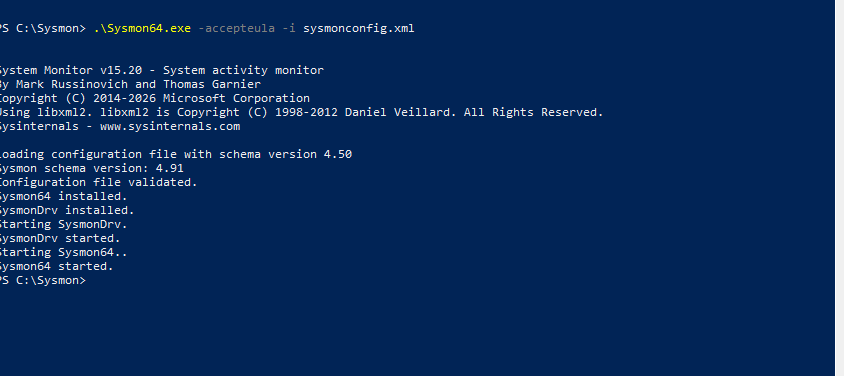

**Sysmon Install Success:**

Sysmon installation with SwiftOnSecurity schema 4.91 loaded. Driver and service installed successfully.

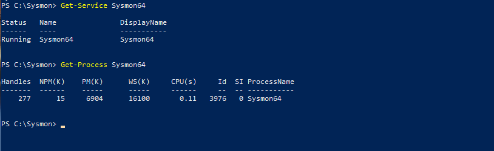

**Sysmon Service Running:**

Sysmon64 service confirmed in Running state with active process (PID 3976).

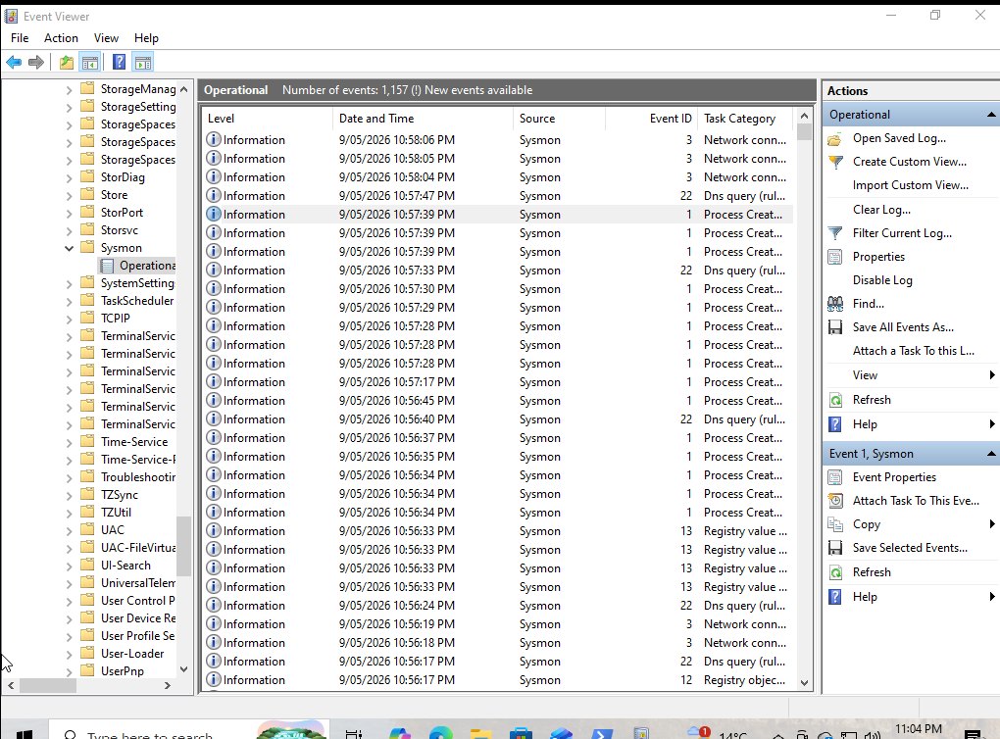

**Sysmon Event Viewer Overview:**

Sysmon Operational log showing 1,157+ events across multiple Event IDs: Process Create (1), Network Connection (3), Registry Modification (13), DNS Query (22).

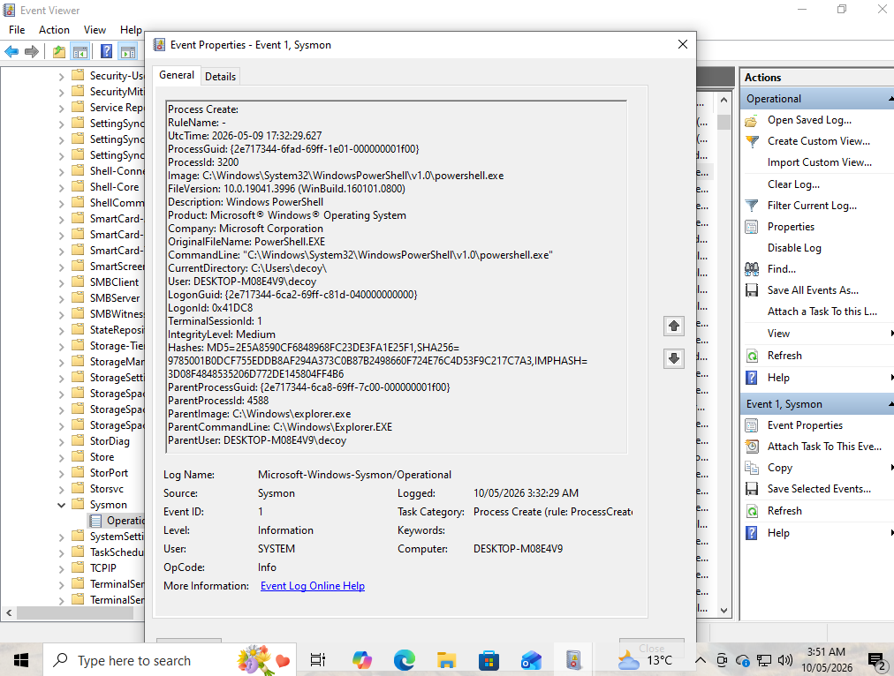

**Powershell Module Logging:**

PowerShell Module Logging registry configuration applied via PowerShell. EnableModuleLogging set to 1 with wildcard module coverage.

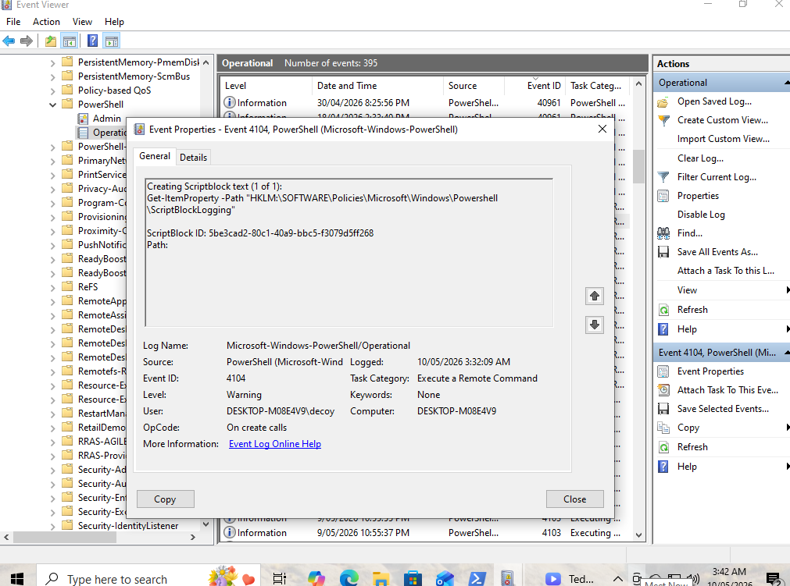

**Powershell EID 4104 Warning:**

PowerShell Event ID 4104 Warning firing on encoded command execution. Script block content captured, demonstrating defensive logging detecting obfuscation attempts.

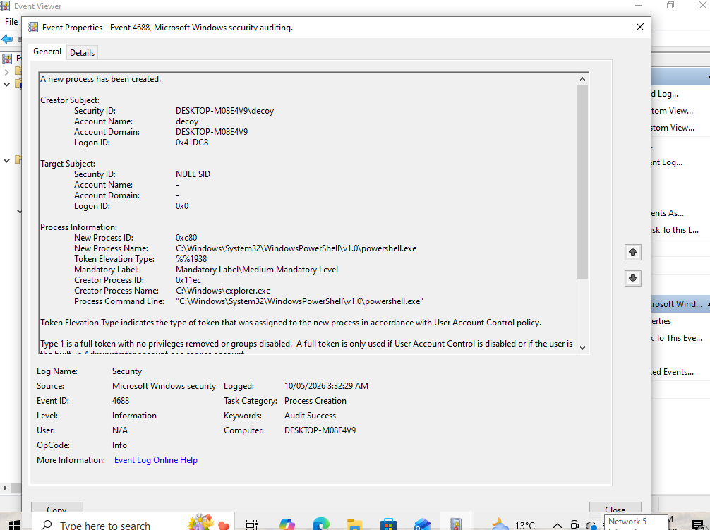

**Audit Policy Command:**

Process Creation auditing enabled via auditpol with command line inclusion configured via registry.

---

## Key Observations

**Win10 Home requires registry-based configuration** 

The lab Windows 10 instance ran Home edition, which lacks `gpedit.msc`. PowerShell logging and command-line auditing were configured via direct Windows Registry edits; Group Policy is fundamentally a UI for writing to registry, so bypassing the GUI achieves identical outcomes while deepening understanding of how Windows policy enforcement actually works.

**PowerShell 5.0+ has baseline Warning-level detection** 

Event ID 4104 fires automatically at Warning level when PowerShell detects suspicious script content (encoded commands, obfuscation patterns) — even without Script Block Logging explicitly enabled. This baseline detection caught the test encoded command immediately, demonstrating that PowerShell ships with built-in attacker tradecraft awareness.

**Multi-source telemetry validates defence in depth** 

A single attacker action generates events across multiple log sources simultaneously: Sysmon captures the process and network context, PowerShell logging captures the script content, and Windows Security log captures native process creation. Attackers may evade one logging mechanism, but evading all three is significantly harder. This redundancy is intentional in enterprise environments and forms the basis for cross-source correlation in detection engineering.

## MITRE ATT&CK Telemetry Coverage

Phase 2 establishes detection telemetry for the following techniques:

| Technique | ID | Telemetry Source |
|---|---|---|
| Command and Scripting Interpreter: PowerShell | T1059.001 | PowerShell EID 4103/4104, Sysmon EID 1, Security EID 4688 |
| User Execution: Malicious Link | T1204.001 | Sysmon EID 1, Sysmon EID 3 |
| Obfuscated Files or Information | T1027 | PowerShell EID 4104 Warning |
| Application Layer Protocol | T1071 | Sysmon EID 3 |
| Input Capture: Web Portal Capture | T1056.003 | Sysmon EID 3 |

## Conclusion

Phase 2 successfully instrumented the Windows 10 victim host across three independent logging layers, transforming it from a passive endpoint into a comprehensive telemetry source. Sysmon, PowerShell logging, and Windows audit policy each capture different aspects of system activity, with overlap that enables cross-source correlation. The Win10 Home registry-based configuration approach, while necessitated by edition limitations, ultimately provided deeper understanding of Windows policy enforcement than a Group Policy GUI workflow would have.

---
